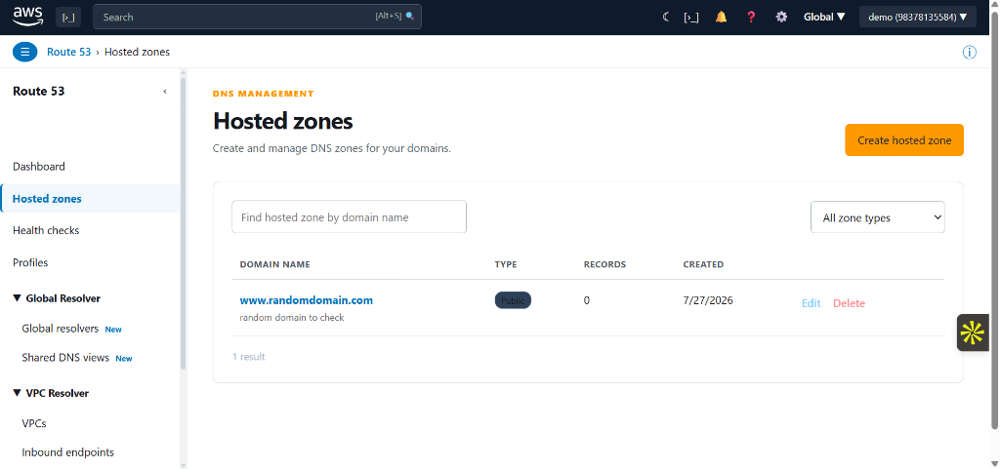
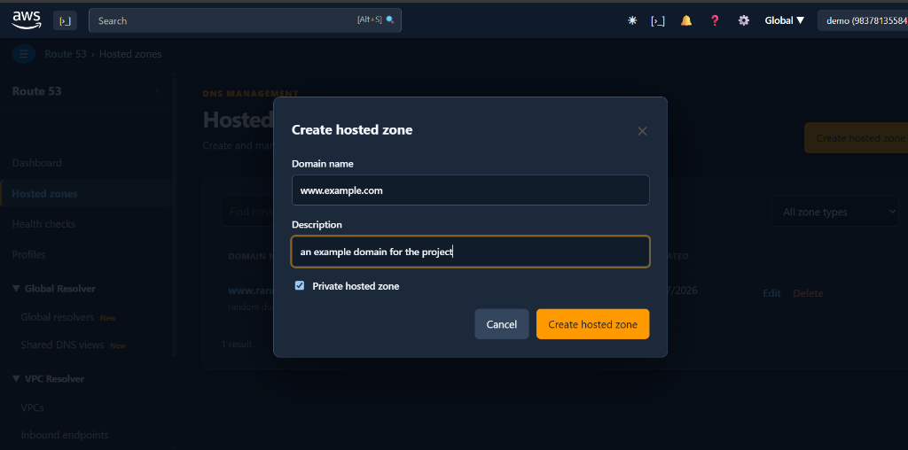
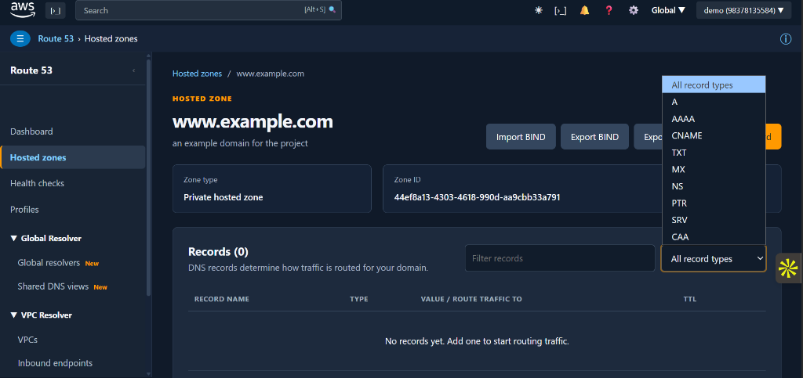

# AWS Route 53 Clone 🌐☁️

A production-ready, full-stack enterprise Cloud DNS Management Platform inspired by the official **AWS Management Console (Amazon Route 53)**. Built with Next.js, FastAPI, SQLAlchemy, PostgreSQL, and custom AWS Ember design aesthetics.

---

## 🌟 Key Working Features

- **AWS Console UI Redesign (85-90%+ Visual Match):**
  - **AWS Sign-In Page:** Features the official AWS logo image, interactive Root/IAM user radio cards (`#0073bb` active border), italicized inputs, AWS orange button (`#ec7211`), purple promo banner, and 3D isometric cube SVG background pattern.
  - **Route 53 Dashboard:** Replicated 4-section service overview grid (**DNS management**, **Availability monitoring**, **Traffic management**, **Domain registration**), subheader breadcrumb bar, and dark console footer.
  - **AWS Light & Dark Navigation Sidebar:** Expandable sections (**Global Resolver**, **VPC Resolver** with *New* badges), active state styling, and theme-adaptive scrollbars.
- **BIND Zone File Import & Export:**
  - **Import BIND (.zone):** Parses BIND zone files with `$ORIGIN`, `$TTL`, comments (`;`), and multiline `SOA` records, automatically bulk-creating DNS records.
  - **Export BIND & JSON:** One-click hosted zone downloads in standard BIND format (`.zone`) or structured JSON (`.json`) with attachment headers.
- **Enterprise DNS Record Management:**
  - Supports `A`, `AAAA`, `CNAME`, `TXT`, `MX`, `NS`, `PTR`, `SRV`, and `CAA` record types with TTL and format validation.
  - Search, record filtering, pagination, and inline CRUD modal forms.
- **Multi-Tenant Security & Isolation:**
  - Password hashing with **PBKDF2-HMAC-SHA256** (310,000 iterations).
  - Auth via signed **JWT Bearer Tokens**.
  - All database queries and CRUD operations are strictly scoped to the authenticated user's ID (`owner_id == user.id`).
- **Dynamic Light & Dark Theme System:**
  - Seamless theme toggle in the AWS Top Navigation Bar (`☀`/`☾`) and User Account Dropdown menu.
  - Custom scrollbars: `#cdd6dc` light thumb in Light Mode, `#34445a` dark thumb in Dark Mode.
- **100% Mobile Responsive Layout:**
  - Slide-in mobile menu drawer with dark backdrop overlay triggered by subheader `☰` button.
  - Touch-enabled table scrolling (`-webkit-overflow-scrolling: touch`), full-width touch buttons, and responsive stacked footers.

---

## 📸 Interface Screenshots & Visual Previews

### 1. Hosted Zones Management List (Light Theme)

> **Description:** Replicated AWS Management Console view for listing all hosted zones in Light Mode. Displays domain names, public/private zone badges, record count, creation timestamps, instant search filtering, zone type selectors, and quick edit/delete actions.

---

### 2. Create Hosted Zone Modal Dialog (Dark Theme)

> **Description:** Dark mode interactive modal dialog for creating a new public or private hosted zone. Includes domain name validation, description text, and private zone toggle matching the AWS Console UI tokens.

---

### 3. Hosted Zone Details & BIND Import/Export Console (Dark Theme)

> **Description:** Record management console for a hosted zone (`www.example.com`). Displays 1-click **Import BIND**, **Export BIND**, and **Export JSON** action triggers, DNS record search bar, record type dropdown filter (`A`, `AAAA`, `CNAME`, `TXT`, `MX`, `NS`, `PTR`, `SRV`, `CAA`), Zone ID, and Zone type overview cards.

---

## 🏗️ System Architecture


```text
                                  +---------------------------------------+
                                  |         Next.js Frontend (Vercel)     |
                                  |  - Next.js Pages Router + TypeScript  |
                                  |  - AWS Ember Design System (Vanilla)  |
                                  +-------------------+-------------------+
                                                      |
                                                      | JSON over HTTP / HTTPS
                                                      | Bearer JWT Authorization
                                                      v
                                  +-------------------+-------------------+
                                  |        FastAPI Backend (Render)       |
                                  |  - FastAPI (Python 3.12)              |
                                  |  - OAuth2 Password Bearer Auth        |
                                  |  - BIND Zone Parser & Exporter        |
                                  +-------------------+-------------------+
                                                      |
                                                      | SQLAlchemy ORM
                                                      v
                                  +-------------------+-------------------+
                                  |  PostgreSQL Database (Render DB)     |
                                  |  - Multi-tenant User Scoping          |
                                  |  - Cascade Deletion on Hosted Zones   |
                                  +---------------------------------------+
```

---

## 📁 Repository Folder Structure

```text
aws-route53-clone/
├── backend/
│   ├── app/
│   │   ├── main.py              # FastAPI app initialization, CORS middleware, router registration
│   │   ├── database.py          # SQLAlchemy engine, session maker, Postgres URI handler
│   │   ├── models.py            # User, HostedZone, and DNSRecord DB ORM models
│   │   ├── schemas.py           # Pydantic request/response validation schemas
│   │   ├── routers/
│   │   │   ├── auth.py          # /api/auth (register, login, login-demo, me)
│   │   │   ├── hosted_zones.py  # /api/hosted-zones (CRUD + BIND/JSON export)
│   │   │   └── dns_records.py   # /api/dns-records (CRUD + BIND import)
│   │   └── utils/
│   │       ├── auth.py          # PBKDF2 password hashing & JWT token creation/verification
│   │       └── bind.py          # BIND zone file parser and exporter engine
│   ├── Dockerfile               # Production multi-stage Docker container
│   ├── requirements.txt         # Python dependencies (FastAPI, SQLAlchemy, psycopg2-binary, PyJWT)
│   └── .env.example             # Backend environment template
├── frontend/
│   ├── assets/                  # Brand image assets (aws-logo@2x.png)
│   ├── components/
│   │   ├── Layout.tsx           # AWS Global Top Bar, Subheader Breadcrumb, and Footer Shell
│   │   ├── Sidebar.tsx          # AWS Light/Dark Console Drawer with Global & VPC Resolver
│   │   ├── HostedZoneTable.tsx  # Responsive hosted zone list table with hover effects
│   │   ├── RecordsTable.tsx     # Responsive DNS records table
│   │   ├── Modals/              # RecordForm, ImportBindModal, ZoneForm components
│   │   ├── Notifications.tsx   # Toast notification provider
│   │   └── Theme.tsx            # Light/Dark mode state provider
│   ├── lib/
│   │   ├── api.ts               # Fetch client wrapper with JWT token injection & export download
│   │   └── store.ts             # Auth state and user session management
│   ├── pages/
│   │   ├── _app.tsx             # Global application wrapper with ThemeProvider
│   │   ├── index.tsx            # Root redirect logic
│   │   ├── login.tsx            # AWS Sign-In page with Root/IAM selector & Demo card
│   │   ├── dashboard.tsx        # AWS Route 53 4-grid service dashboard
│   │   ├── hosted-zones/        # Hosted zones list and [id].tsx detail pages
│   │   ├── health-checks.tsx    # Availability monitoring page
│   │   ├── traffic-policies.tsx # Traffic management page
│   │   ├── resolver.tsx         # Global resolver page
│   │   └── profiles.tsx         # Route 53 profiles page
│   └── styles/
│       ├── globals.css          # Core CSS variables, AWS Console styles & media queries
│       └── themes.css           # Dynamic data-theme="light" and data-theme="dark" tokens
├── render.yaml                  # Render Blueprint definition (Web API + Managed Postgres)
└── README.md                    # Project documentation
```

---

## ⚡ Quick Start Tutorial (Run Locally)

### Prerequisites
- **Node.js**: v18.0.0 or later
- **Python**: 3.10, 3.11, or 3.12

### 1. Launch FastAPI Backend

Open a terminal window and run:

```powershell
cd backend
python -m venv venv

# On Windows:
.\venv\Scripts\Activate.ps1
# On macOS/Linux:
# source venv/bin/activate

pip install -r requirements.txt
Copy-Item .env.example .env
uvicorn app.main:app --reload --port 8000
```

The API will start at `http://localhost:8000`. Interactive Swagger API docs are available at `http://localhost:8000/docs`.

### 2. Launch Next.js Frontend

Open a second terminal window and run:

```powershell
cd frontend
Copy-Item .env.local.example .env.local
npm install
npm run dev
```

The web console will launch at `http://localhost:3000`.

---

## 🚀 Production Deployment Guide

### Deploying Backend to Render
1. Push your repository to GitHub (`git push origin main`).
2. Go to **Render Dashboard** -> **New** -> **Blueprint**.
3. Connect your repository containing `render.yaml`.
4. Render will automatically provision:
   - **`route53-clone-db`**: Managed PostgreSQL database (Free tier).
   - **`route53-clone-api`**: Web service running `backend/Dockerfile`.
5. Set environment variable on Render:
   - `CORS_ORIGINS` = `https://your-frontend-app.vercel.app`

### Deploying Frontend to Vercel
1. Go to **Vercel Dashboard** -> **Add New Project**.
2. Select your `aws-route53-clone` repository.
3. Set **Root Directory** to `frontend`.
4. Set Environment Variable:
   - `NEXT_PUBLIC_API_URL` = `https://route53-clone-api.onrender.com`
5. Click **Deploy**.

---

## 📑 API Reference

All protected endpoints require `Authorization: Bearer <jwt_token>`.

| Method | Endpoint | Description |
| --- | --- | --- |
| `POST` | `/api/auth/register` | Register new user account |
| `POST` | `/api/auth/login` | Authenticate user & return JWT token |
| `POST` | `/api/auth/login-demo` | Sign in or auto-create demo user |
| `GET` | `/api/auth/me` | Fetch current authenticated user |
| `GET` | `/api/hosted-zones` | List all hosted zones for user |
| `POST` | `/api/hosted-zones` | Create a new hosted zone |
| `GET` | `/api/hosted-zones/{id}` | Get hosted zone details |
| `PUT` | `/api/hosted-zones/{id}` | Update hosted zone |
| `DELETE` | `/api/hosted-zones/{id}` | Delete hosted zone and cascade records |
| `GET` | `/api/hosted-zones/{id}/export` | Export zone (`format=bind` or `format=json`) |
| `GET` | `/api/dns-records/zone/{id}` | List all DNS records in a zone |
| `POST` | `/api/dns-records/zone/{id}` | Create a new DNS record |
| `POST` | `/api/dns-records/zone/{id}/import-bind` | Import DNS records from BIND text |
| `PUT` | `/api/dns-records/record/{id}` | Update existing DNS record |
| `DELETE` | `/api/dns-records/record/{id}` | Delete DNS record |

---

## 🛡️ License & Acknowledgments

Built for educational & cloud architectural demonstration purposes. Inspired by **Amazon Web Services (AWS) Route 53**.
